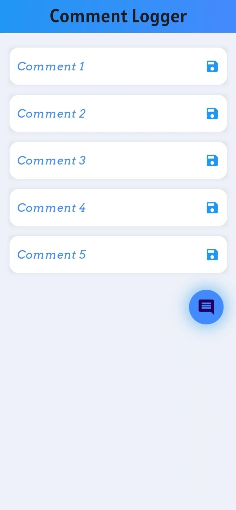
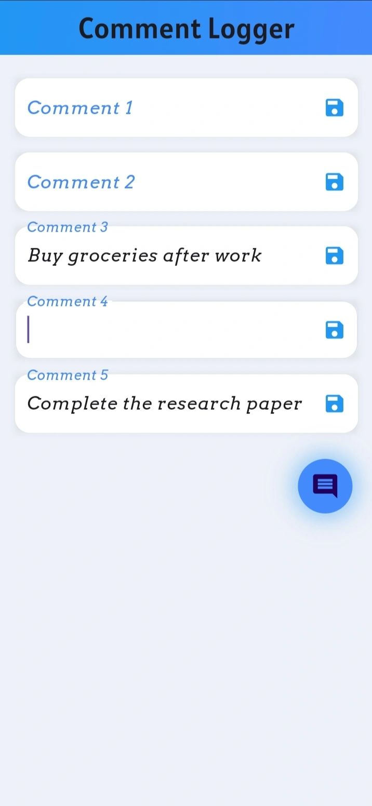
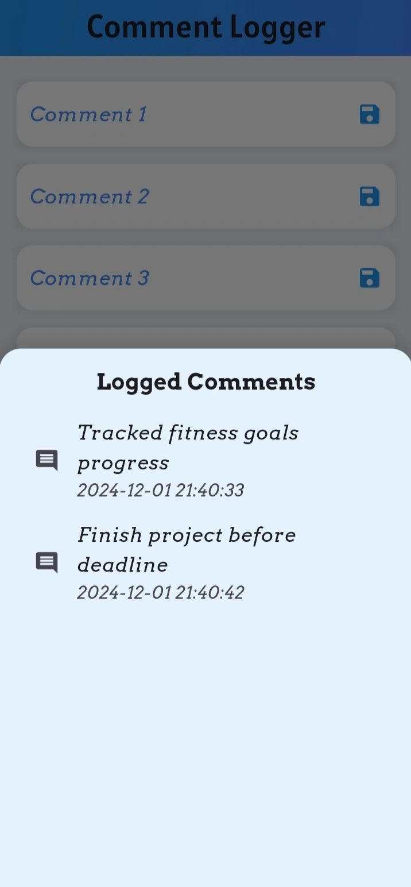

<!-- Screenshots -->
### 📸 Screenshots

  
  
  

---

# 🚀 Flutter-Powered Comment Logger Application 🚀

### A lightweight, user-centric application to instantly log, view, and retain comments — powered by Flutter for blazing-fast performance.

---

## 📘 Project Description

This Comment Logger App is built to simplify the process of note-taking and comment logging on the fly. Designed with real-world usability in mind, it supports **automatic saving**, **local data persistence**, and an intuitive **draggable floating button**, making it ideal for anyone who needs a quick and reliable comment management tool.

At just **7.69 MB**, this app offers powerful utility with minimal footprint.

---

## ✨ Key Features

- ✅ **Auto-Save Functionality**  
  Comments are automatically stored as users type — no save button required. Data is preserved even after restarts.

- 🧲 **Draggable Floating Icon**  
  A persistent floating icon that can be repositioned freely on the screen for quick access.

- 💾 **Local Storage with Shared Preferences**  
  Comments are securely saved on the device with no internet dependency.

- 🧭 **User-Friendly Interface**  
  Clean, responsive design focused on usability and minimalism.

- 📦 **Compact APK Size**  
  Just **7.69 MB**, ensuring quick downloads and low storage use.

---

## 🤝 Contribution

Contributions are welcome!

1. Fork this repository  
2. Create a feature branch: `git checkout -b feature-name`  
3. Make your changes and commit: `git commit -m "Added feature"`  
4. Push to your fork: `git push origin feature-name`  
5. Create a Pull Request

Please follow best practices and maintain code clarity.

---

## 🙏 Thank You

Thank you for taking the time to explore this project. Whether you're an HR professional reviewing technical capabilities or a fellow developer curious about efficient Flutter patterns — your interest is appreciated!

📧 Email: [bershayit@gmail.com](mailto:bershayit@gmail.com)  
🔗 LinkedIn: [linkedin.com/in/bershayit](https://www.linkedin.com/in/bershayit)

---

> **#Flutter #LocalStorage #CommentLogger #SharedPreferences #LightweightApp**
